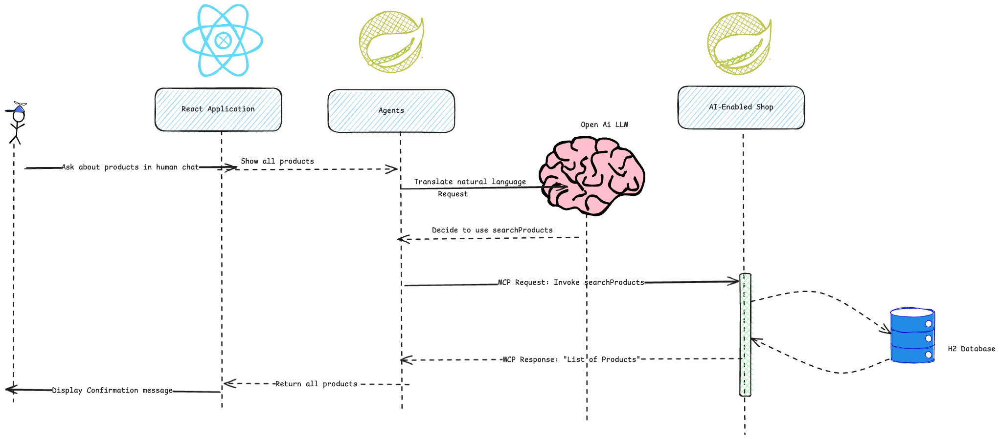

# ZeniMarketplaceAgent

Flow of the project!

# Spring AI - Lab Instructions

Prerequisites: before starting this course, you should have the following installed:

Java Development Kit (ideally version 21 or later)
Maven (version 3.8.6 or later)
Node.js (version 18 or later)

An IDE such as IntelliJ Community Edition or Ultimate Edition (ideally the latest version)

an OpenAI API KEY to get [here]( https://ctxt.io/2/AAB4vv0pEA)

General guideline

This lab guide relies on the examples seen in the [slides] (https://docs.google.com/presentation/d/1c7qB-nLaqTAZbm62Sd5AhUxfQfNpKlFsF-q-EKJJZHg/edit?usp=sharing).
In order to have all the information you need, you should have the lab instructions and the slides side by side, so you can refer to the examples seen in the slides at any time.


## Table of Contents

1. [Setting up Spring AI with OpenAI](#setting-up-spring-ai-with-openai)
2. [Using the ChatClient](#using-the-chatclient)
3. [Logs, entities, and images](#logs-entities-and-images)
4. [Retrieval Augmented Generation](#retrieval-augmented-generation)

---

### 1. Setting up Spring AI with OpenAI

Our first goal is to install the Spring AI dependencies and write a simple API call to an LLM (ChatGPT will be used as an example)

#### 1.1 Setting up your Spring AI project
- Make sure you have Java version 21 installed.
- Install the dependencies using `mvn clean install -DskipTests`

If you don't have installed IntelliJ and Java 21 you can use this online environment for this HandsOn [OnlineIDE](https://replit.com/@puls972/SpringAiHandsOn)
- Create a new account (Free)
- Fork the project
- Access the shell
- Install the dependencies using `mvn clean install -DskipTests`

#### 1.2 application.properties configuration
-Specify `gpt-4o` as the OpenAI model to be used in the parameter `spring.ai.openai.chat.options.model`

As seen in the slides, it is not a best practice to store an API key inside [application.properties](src/main/resources/application.properties) because it would be stored on git.
Instead, it should use the ${OPENAI_API_KEY} syntax in order to refer to an environment variable.
You do not need to setup the environment variable at this stage, as it will be later setup inside your JUnit test

#### 1.3 Running your first JUnit test
- In `src/main/test`, update the [HandsonApplicationTests](handson/src/test/java/com/zenika/handson/HandsonApplicationTests.java) class:
  ```java
  @SpringBootTest
  class ApplicationTests {

      @Value("${spring.ai.openai.api-key}")
      private String apiKey;

      @Test
      void contextLoads() {
          assertThat(apiKey).isNotEmpty();
      }
  }
  ```
- As seen in the slides, update your JUnit test configuration so it properly sets the value for the environment variable OPENAI_API_KEY, you can get the key [here]( https://ctxt.io/2/AAB4vv0pEA) (not required for online IDE)
- Run your test to verify setup.
- (To run the test for the online IDE execute in the shell `mvn -Dtest=ApplicationTests test` )

### 2. Using the ChatClient

#### 2.1 Using the ChatClient to setup a seller Marketplace Agent
1. Update the class [AgentConfiguration](handson/src/main/java/com/zenika/handson/configuration/AgentConfiguration.java)  in `com.zenika.handson.configuration`.

   As its name says, it is a Spring Configuration and should be annotated with the `@Configuration` stereotype annotation

2. Initialize the `@Bean chatClient` with the name `sellerAgentChatClient` in the [AgentConfiguration](handson/src/main/java/com/zenika/handson/configuration/AgentConfiguration.java)
  ```java
@Bean
ChatClient sellerAgentChatClient(ChatClient.Builder chatClientBuilder) {
    /**
     * Create a ChatClient instance for the seller agent.
     * This client will be used to interact with the OpenAI API.
     */
}
  ```
Set the `defaultSystem` prompt to `GENERAL_MARKET_PLACE_PROMPT` constant localized in [PromptContants](handson/src/main/java/com/zenika/handson/constant/PromptContants.java).

3. Inside [PromptContants](handson/src/main/java/com/zenika/handson/constant/PromptContants.java), Fill up the variable `GENERAL_MARKET_PLACE_PROMPT`, with a guideline for the chat client to be a marketplace named "Zeni Marketplace" who sell products to customer. The prompt should be similar to the one below:
  ```java
public static final String GENERAL_MARKET_PLACE_PROMPT = """
    You are a helpful assistant in a market place named ZeniMarket.
        Your role is to politely assist users about their inquiries related to products, orders, and general information about the market place.
    """;
  ```
try to do it by yourself.

4. Update a JUnit test [SellerAgentTests](handson/src/test/java/com/zenika/handson/agents/seller/SellerAgentTests.java) complete the methode `sellerAgentCanCommunicate` and make sure the test is passing.

### 3. Chat Memory

#### 3.1 Using chat memory to keep track of the conversation
1. Run the JUnit test [SellerAgentTests](handson/src/test/java/com/zenika/handson/agents/seller/SellerAgentTests.java) `sellerAgentChatMemory` test
   Why is it failing? What is the problem?
2. Update the [AgentConfiguration](handson/src/main/java/com/zenika/handson/configuration/AgentConfiguration.java) to add a `@Bean` called `defaultChatMemoryAdvisor` that will be used to store the conversation history.
```java
    @Bean
    PromptChatMemoryAdvisor defaultChatMemoryAdvisor(...) {
        /**
         * Create a PromptChatMemoryAdvisor instance that will be used to store the conversation history.
         * This advisor will be used by the ChatClient to keep track of the conversation.
         */
        
    }
```
3. Update the [AgentConfiguration](handson/src/main/java/com/zenika/handson/configuration/AgentConfiguration.java) to inject the `defaultChatMemoryAdvisor` into the `sellerAgentChatClient` bean.

4. Run the JUnit test [SellerAgentTests](handson/src/test/java/com/zenika/handson/agents/seller/SellerAgentTests.java) `sellerAgentChatMemory` test again and check if the test is passing now.

#### 4 UI
#### 4.1 Setup an UI to discuss with the seller agent
1. In the  [AiMarketPlaceController](handson/src/main/java/com/zenika/handson/controllers/AiMarketPlaceController.java) define a new endpoint `/api/marketplace/chat` that will be used to communicate with the seller agent.
   - Define those two records in the controller:
```java
record ChatRequest(String message, String user) {}
record ChatResponse(String response) {}
```
   - The endpoint should accept a POST request with a JSON body containing a `ChatRequest` field.
   - The endpoint should return a JSON response containing a `ChatResponse` field.
```java
@CrossOrigin(origins = {"http://localhost:3000", "http://127.0.0.1:3000"})
@PostMapping("/chat")
public ChatResponse generate(@RequestBody ...) {
    /**
     * This method will be used to communicate with the seller agent.
     * It will use the ChatClient to send the message and return the response.
     */
  ...
  return new ChatResponse(response);
}
```
  - Inject the `sellerAgentChatClient` into the controller and use it to send the message to the agent.
2. Install and run the UI located in  ...(to continue @Jai)

#### 5 MCP
#### 5.1 Retrieve information using MCP
If you did not complete the section 3.1, please checkout the branch : `solution_3.1`
1. Using the UI or a curl command, ask to your agent to list the products available in the marketplace.
   - What is the response? Is it what you expected?
   If you are not using the UI you can use the following curl command:
   - ```bash
     curl -X POST http://localhost:8080/api/marketplace/chat \
     -H "Content-Type: application/json" \
     -d '{"message": "List the products available in the marketplace", "user": "test"}'
     ```
- Inside the package `com.spring.book`, create a new Java record called Book. It should have 2 attributes: author and title.
- Inside [BookRecommendationService](src/main/java/com/spring/book/BookRecommendationService.java), add a method called `findFictionBook`. It should use a ChatClient instance in order to ask for the best fiction book in year 2023 and return the response as a Book entity.
- Inside BookRecommendationServiceTest, add a method `shouldFindFictionBook`. It should call BookRecommendationService.findFictionBook(), log the result, and assert that the result is not empty.
- Run `BookRecommendationServiceTest` and double-check that the request to OpenAI provides JSON Schema guidelines. (Uncomment the @Configuration in [HttpLoggingConfiguration](src/main/java/com/spring/config/HttpLoggingConfiguration.java))

  (For the online IDE execute in the shell `mvn -Dtest=BookRecommendationServiceTest#shouldFindFictionBook test` )


If you are able to see the response in the logs, you have successfully mapped your response to an entity, congratulations!


#### 3.3 What’s the Weather Like? (Image Model API)
If you did not complete the section 3.2, please checkout the branch : `solution_3.2`

Inside the folder src/main/resources, you have a folder [weather](src/main/resources/weather), check the lab file [singapore-weather.png](src/main/resources/weather/singapore-weather.png).
- Create a new java package `com.spring.weather`. Inside this package, create a class called `WeatherService`. As seen in the slides, it should load [singapore-weather.png](src/main/resources/weather/singapore-weather.png) as a `org.springframework.core.io.Resource` and use it to make a call to the LLM. The question should be "what will be the weather like on Tuesday"
- When done, create a test class called `com.spring.weather.WeatherServiceTest`.
  Before running `WeatherServiceTest`, edit its run configuration and add an environment variable `OPENAI_API_KEY` for the OpenAI API [key]( https://ctxt.io/2/AAB4vv0pEA) (not required for online IDE)

(For the online IDE execute in the shell `mvn -Dtest=WeatherServiceTest test` )


If you are able to call `WeatherService` successfully and get the correct weather forecast, you have completed this lab, congratulations!

### 4. (BONUS) Retrieval Augmented Generation / Vector DB

Congratulation ! The handsOn is now over. If you want more, here is a new challenge :
- Checkout the project : https://github.com/michaelisvy/demo-spring-ai/
- Read the ReadMe instruction and try to run one of the following : `MusicWithContextService`, `BookSearchService`


